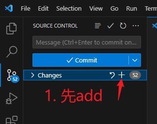
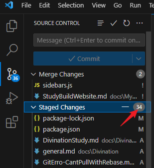
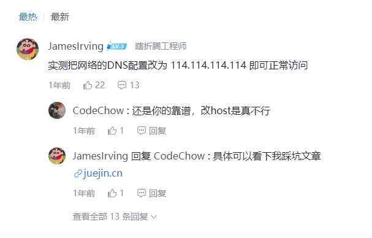

# 推送代码到远程仓库失败

---

## 备份是个好习惯

> 我建议，不只是上传到 GitHub 进行版本控制，**最好在本地也进行备份**。
  

---

> 参考自：
> 1. [git push错误failed to push some refs to的解决方法](https://www.cnblogs.com/Rainingday/p/12364690.html)
> 2. [使用git stash命令保存和恢复进度](https://blog.csdn.net/daguanjia11/article/details/73810577)
>
> 
> 2023年10月26日

---

## 正文

### push 出错

> 可恶，之前在 GitHub 上在线修改了 notes 仓库里的文件，而我在本地又修改了许多代码，导致我把本地代码 push 到 GitHub 上时出错了  
>
> 错误信息：

```bash
To https://github.com/Ratherthan17/my-website.git
 ! [rejected]        main -> main (fetch first)
error: failed to push some refs to 'https://github.com/Ratherthan17/my-website.git'
hint: Updates were rejected because the remote contains work that you do not
hint: have locally. This is usually caused by another repository pushing to
hint: the same ref. If you want to integrate the remote changes, use
hint: 'git pull' before pushing again.
hint: See the 'Note about fast-forwards' in 'git push --help' for details.
```

<!-->原来是因为，<-->


### 解决办法：

#### 1. 先将工作区中未完成的内容添加到暂存区  

  

#### 2. 查看本地库与哪些远程库有联系

- 在终端里输入 ``` git remote -v ``` 查看本地库与哪些远程库有联系  

  

#### 3. 保存未完成的工作进度

- 输入 ``` git stash save '信息' ``` 保存未完成的工作进度

  

  

  
#### 4. 把远程库中的更新合并到本地库中

- 输入 ``` git pull --rebase origin branch ``` ，origin 就是第二步输入 ``` git remote -v ``` 后显示的与本地库有联系的远程库，不一定是 origin ，我这里就是 my-website ; branch 你要 push 到哪个分支就输入哪个分支，我这里是主分支 main  
  
  

#### 5. 恢复之前保存的工作进度

- 输入 ``` git stash pop ``` ，把之前保存的工作进度恢复

  

#### 6. 解决冲突

- 点击 Merge Changes 里的文件，在打开的窗口里点击标红的地方，跳转到冲突位置

  
  

-  以我这里的 Divination 为例，绿色区域（Current Change）是它在 GitHub 上的样子，蓝色区域（Incoming Change）是它在本地的样子。

  

- 要是想保留远程库的内容，就把本地的（蓝色区域）删掉，再删去 <<<<<<< Updated upstream 、 ======= 和 >>>>>>> Stashed changes

  

- 要是想保留本地的内容，就把远程库（绿色区域）删掉，再删去 <<<<<<< Updated upstream 、 ======= 和 >>>>>>> Stashed changes

  

- 要是远程和本地的内容都想保留，就只需把 <<<<<<< Updated upsteam 、 ======= 和 >>>>>>> Stashed changes 删掉就可以了

  

- 使用 VSCode 提供的按钮可以很方便的进行修改

  - 保留远程库的内容 ——> 点击 `Accept Current Change`

   

  - 保留本地库的内容 ——> 点击 `Accept Incoming Change`

   

  - 俩都保留 ——> 点击 `Accept Both Changes`

    

#### 7. 取消暂存

- 之前第 5 步是恢复工作进度；第 6 步是解决冲突；这一步是把现在还没完成的、还不想提交的内容取消 暂存 ，可选。
  现在应该已经可以 推送 了

  

- 另外，我发现我的 changes 少了（应该是我这个项目的问题，我做 “从我的 Github 上 clone 下来的网站，用 npm start 出错” 这篇笔记的时候就没少）

  
  

---

## 其他

### 解决过程中曾遇到过的错误

1. 我看了B站UP主 编程八点档 的 *[`【搞笑Git教程】15 git pull和git fetch | 一套带走 快速上手 保姆级 | 持续更新`][git pull和git fetch]* 这一期视频，其中 `1分41秒` 有一句 `（up to date）表示当前本地和远程是同步状态`  ； `2分27秒` 有一句 `（local out of date）本地状态落后于远程仓库` 。  
我想看看我的是哪个状态，于是在终端里输入了 `git remote show origin`
结果出错了：
```
PS C:\Users\Administrator\Desktop\张雨齐\计算机学习\my-website> git remote show origin
fatal: 'origin' does not appear to be a git repository
fatal: Could not read from remote repository.

Please make sure you have the correct access rights
and the repository exists.
```
我又看了另一个B站UP主 技术蛋老师 的  *[`Git工作流和核心原理 | GitHub基本操作 | VS Code里使用Git和关联GitHub`][Git工作流和核心原理]* 这一期视频，`15分15秒` 提到可以用 `git remote -v` 指令来看本地仓库和哪些远程仓库有联系，  
我输入 `git remote -v` 后，结果为：  

```
PS C:\Users\Administrator\Desktop\张雨齐\计算机学习\my-website> git remote -v
my-website      https://github.com/Ratherthan17/my-website.git (fetch)
my-website      https://github.com/Ratherthan17/my-website.git (push)
```

他们的是 `origin` ，而我的是 `my-website` ，难道是因为我先在本地创建，然后才 push 上去，而不是 clone 下来的？（Yes——来自未来的我，2024-03-05-14:59）

我重新输入 `git remote show my-website` ，又遇到了错误：
```
PS C:\Users\Administrator\Desktop\张雨齐\计算机学习\my-website> git remote show my-website  
fatal: unable to access 'https://github.com/Ratherthan17/my-website.git/': Failed to connect to github.com port 443 after 21238 ms: Couldn't connect to server 
```

我在 *[GitHub无法访问、443 Operation timed out的解决办法][443 Operation timed out的解决办法]* 这篇文章——的评论区找到了解决办法

  

:::note备注
因评论区那位大佬提供的方法很简单，我就先试的他的，成了后，**这篇文章的作者的办法我就没试，所以我也不知道有没有效果**
:::

成功后，结果为：

```
PS C:\Users\Administrator\Desktop\张雨齐\计算机学习\my-website> git remote show my-website
* remote my-website
  Fetch URL: https://github.com/Ratherthan17/my-website.git
  Push  URL: https://github.com/Ratherthan17/my-website.git
  HEAD branch: main
  Remote branches:
    gh-pages new (next fetch will store in remotes/my-website)
    main     tracked
  Local branch configured for 'git pull':
    main merges with remote main
  Local ref configured for 'git push':
    main pushes to main (local out of date)
```

**(local out of date)** ，的确是本地状态落后于远程仓库。


<!-->### **备份是个好习惯**<-->


[git pull和git fetch]: https://www.bilibili.com/video/BV1E3411c7cb/?spm_id_from=333.999.0.0&vd_source=4f65863adf19c12522e7026402e62e53

[Git工作流和核心原理]: https://www.bilibili.com/video/BV1r3411F7kn/?spm_id_from=333.1007.top_right_bar_window_custom_collection.content.click&vd_source=4f65863adf19c12522e7026402e62e53

[443 Operation timed out的解决办法]: https://juejin.cn/post/6844904193170341896