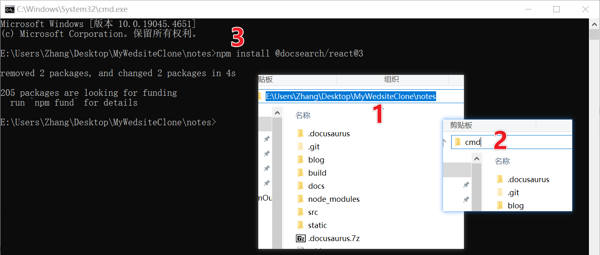
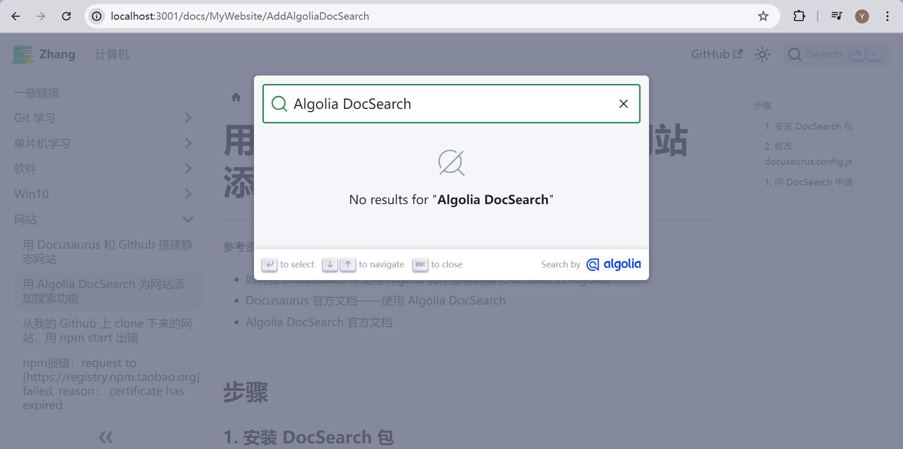
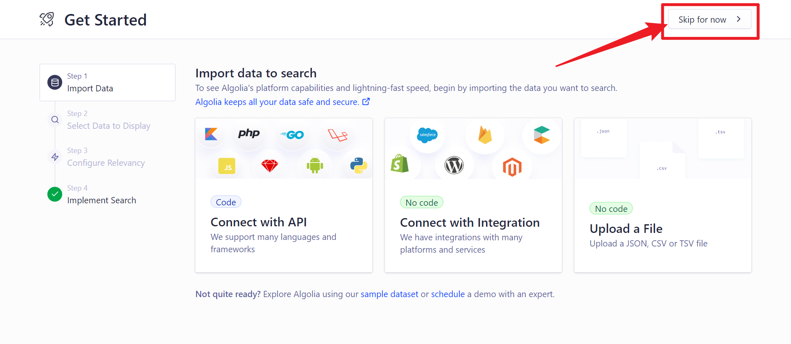
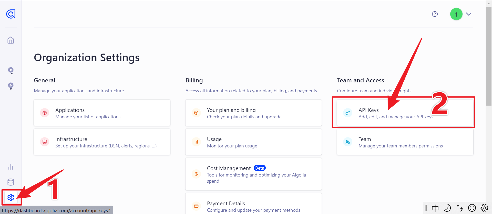
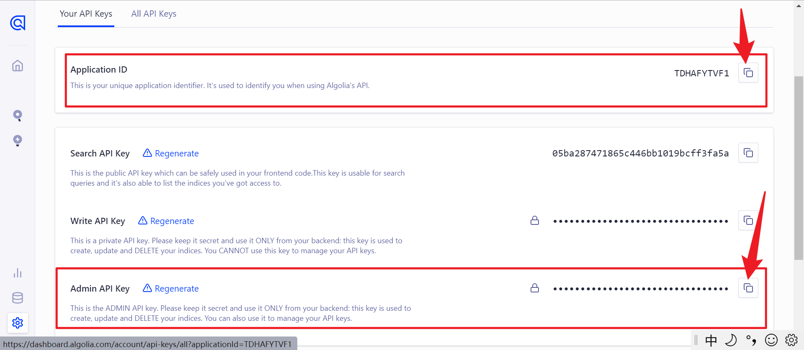
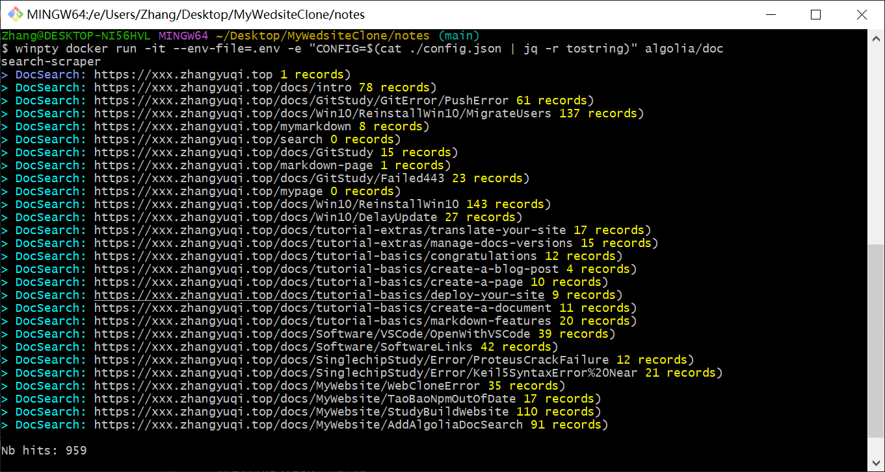
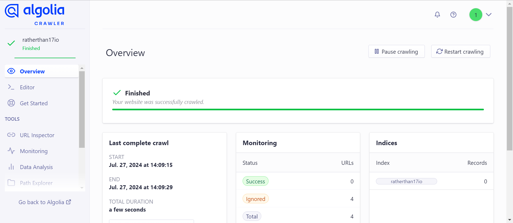

# 用 Algolia DocSearch 为网站添加搜索功能

---

## 参考资料：

### 步骤

- [★ 如何在 Docusaurus 中使用 Algolia 實作搜尋功能 (Docusaurus Algolia)](https://youtu.be/cykGdsbe6f0)
    - [[docusaurus] 在 Docusaurus 中使用 Algolia 實作搜尋功能——上面视频的配套笔记](https://weiyun0912.github.io/Wei-Docusaurus/docs/Docusaurus/Algolia/)
- [★ 手动给docusaurus添加一个搜索](https://blog.csdn.net/superfjj/article/details/137941874)
- [★ 如何手动跑algolia的爬虫来打造自己的站点搜索呢🤔](https://juejin.cn/post/7265265606436962341#heading-6)
- [★ 给你的网站添加Algolia全文索引吧](https://juejin.cn/post/7242284648021639227)
- [Docusaurus 官方文档——使用 Algolia DocSearch](https://docusaurus.io/zh-CN/docs/next/search#using-algolia-docsearch)
- [Algolia DocSearch 官方文档](https://docsearch.algolia.com/)

---

### 错误

- [How to Fix Vercel 404 error: Child URL Path Issues](https://dev.to/david_bilsonn/how-to-fix-vercel-404-error-child-url-path-issues-n0o)
- [如何通过 vercel 进行域名重定向](https://new.bg7iae.com/2023/07/18/usevercelrewrites/)

---

## 步骤

### 1. 安装 DocSearch 包

- 在你的项目目录下打开命令行窗口，输入以下命令，安装 DocSearch 包

    ```
    npm install @docsearch/react@3
    ```
    

- 如果安装成功的话，package.json 里会多一行 `"@docsearch/react": "^xxx",`

    ```js title="package.json" showLineNumbers
    ...
    "dependencies": {
     // highlight-next-line   
    "@docsearch/react": "^3.6.1",
    "@docusaurus/core": "2.4.3",
    "@docusaurus/preset-classic": "2.4.3",
    "@mdx-js/react": "^1.6.22",
    "clsx": "^1.2.1",
    "prism-react-renderer": "^1.3.5",
    "react": "^17.0.2",
    "react-dom": "^17.0.2"
    ...
  },
  ...
    ```   
### 2. 修改 docusaurus.config.js

- 在 docusaurus.config.js 中的 themeConfig 里添加高亮的代码部分：

    ```js showLineNumbers title="docusaurus.config.js"
    ...  
    themeConfig:
    /** @type {import('@docusaurus/preset-classic').ThemeConfig} */
    ({
        // highlight-start
        algolia:{
            // Algolia 提供的应用 ID
            appId: 'YOUR_APP_ID',

            //  公开 API 密钥：提交它没有危险
            apiKey: 'YOUR_SEARCH_API_KEY',

            indexName: 'YOUR_INDEX_NAME',
        },
        // highlight-end

      // Replace with your project's social card
      image: 'img/docusaurus-social-card.jpg',
      navbar: {
        title: 'Zhang',//改这里，是Mysite
        logo: {
          alt: 'My Site Logo',
          src: 'img/logo.svg',//这里是导航栏的logo
        },
        items: [
          {
            type: 'docSidebar',
            sidebarId: 'tutorialSidebar',
            position: 'left',
            label: '计算机',//这里是Tutorial
          },
          ...
    }),
    ...
    ```

- 添加了 algolia:{} 后，你会发现 本地构建的 localhost:3000 网站出错了

    

- 不用管它，把网页关闭，重新 npm start 一下，看！右上角多了个搜索框！

    


- 不过现在它就是个摆设，还不能搜出东西来，需要进行下一步配置

    


### 3. 注册、登陆 Algolia，获取appID、apiKey

#### 1. 登陆 Algolia

- 点击 [→ *Algolia 官网链接* ←](https://dashboard.algolia.com/users/sign_in) ，打开后往下划，可以用 Github 注册

    - 如果显示让你 Get Started ，不用管，点击右上角的 Skip for now

    
    
#### 2. 创建 Application

- 登进去后，点击左下角的 settings -> Applications -> Create Application

    - 最后选没有（Contact us）的

    

    - 如果显示让你 Get Started ，不用管，点击右上角的 Skip for now

    - 在  settings -> Applications ，新建的 Application 右边点三个点，可以重命名

#### 3. 新建 index

- 点击左边导航栏中的 Search , 接着点击 Create Index ，新建一个 index

    

#### 4. 获取 appID、apiKey {#4.获取appIDapiKey}

- ([*点我跳回设置 .env *](#.env))

- 点击 Settings -> APIKeys ，在这里可以找到 Application ID 和 API Key 

    
 
- 打开 docusaurus.config.js ，修改之前 algolia:{} 中的 appID 、 apiKey 和 indexName 。
   
:::caution注意
这里会有很多个 key ，algolia:{} 中的 apiKey ，用 Search API Key
:::

- indexName 就是你新建 index 时自己取得名字

    - 也可以点击左边的 search ，在这里找到 index name

    


### 4. 配置爬虫

#### 1. 设置 .env（环境变量）{#.env}

- 在项目根目录里新建个文本文档，名字空着什么也不写，扩展名改为 ` .env `

    - 接着用记事本打开它，把下面的代码复制进去

    ```js title=".env"
    APPLICATION_ID=YOUR_APP_ID
    API_KEY=YOUR_API_KEY
    ```
    - 切回 Algolia ，用  [*4. 获取 appID、apiKey(点我跳转)*](#4.获取appIDapiKey) 中的方法，找到 appID 和 apiKey

    :::caution注意
    .env 中的 apiKey 要用 Admin API Key 
    :::
   
    
  
:::danger危险
记得把 .env 文件添加到 .ignore 里，不要上传到 Github 上
:::


   
#### 2. 配置爬虫规则

- 在项目根目录里新建个文本文档，名字和扩展名改为 ` config.json `，并把下面代码复制粘贴进去    

- 其中高亮的三行需要修改

    ```json title="config.json"
    {
        //highlight-start
        "index_name": "YOUR_INDEX_NAME",
        "start_urls": ["https://YOUR_WEBSITE_URL"],
        "sitemap_urls": ["https://YOUR_WEBSITE_URL/sitemap.xml"],
        //highlight-end

        "sitemap_alternate_links": true,
        "selectors": {
            "lvl0": {
            "selector": "(//ul[contains(@class,'menu__list')]//a[contains(@class, 'menu__link menu__link--sublist menu__link--active')]/text() | //nav[contains(@class, 'navbar')]//a[contains(@class, 'navbar__link--active')]/text())[last()]",
            "type": "xpath",
            "global": true,
            "default_value": "Documentation"
            },
            "lvl1": "header h1",
            "lvl2": "article h2",
            "lvl3": "article h3",
            "lvl4": "article h4",
            "lvl5": "article h5, article td:first-child",
            "lvl6": "article h6",
            "text": "article p, article li, article td:last-child"
        },
        "strip_chars": " .,;:#",
        "custom_settings": {
            "separatorsToIndex": "_",
            "attributesForFaceting": ["language", "version", "type", "docusaurus_tag"],
            "attributesToRetrieve": [
            "hierarchy",
            "content",
            "anchor",
            "url",
            "url_without_anchor",
            "type"
            ]
        },
        "conversation_id": ["833762294"],
        "nb_hits": 46250
    }
    ```

- 第一个 index_name 不必说了，第二个 "start_urls" 和第三个 "sitemap_urls" 中 "/sitemap.xml" 之前的内容是你的网站地址 

    - 以我为例，我原先用的是 "https://ratherthan17.github.io/notes/" ，这两处填这个地址
    - 后来买了个域名，现在是 "https://xxx.zhangyuqi.top" ，这时这里填这个地址。
    - **你部署到 github pages 时，docusaurus.config.js 中的 url + baseUrl 是啥，这两处就填啥**

    ```js title="docusaurus.config.js"
    ...
    const config = {
    title: 'Zhang的知识库',
    tagline: 'Dinosaurs are cool',
    favicon: 'img/LogoIcon/WebIcon.png',//这个是标签页的图标

    // Set the production url of your site here
    //highlight-next-line
    url: 'https://xxx.zhangyuqi.top',//看下一行
    //当部署到 github pages 上时，用 https://xxx.zhangyuqi.top
    //上传到 main 分支时用 https://www.zhangyuqi.top ，这是我的 vercel 用的域名
    //不用域名是 https://Ratherthan17.github.io

    // Set the /<baseUrl>/ pathname under which your site is served
    // For GitHub pages deployment, it is often '/<projectName>/'
    //highlight-next-line
    baseUrl: '/',//这个不用动//github.io 是 '/notes/'
    ...
    }
    ...
    ```


#### 3. 安装 Docker Desktop 及 jq(json解析器)

- [*Docker Desktop 官网*](https://docs.docker.com/desktop/install/windows-install/)

:::warning注意
这个软件安装完后，会有一个按钮是 Close And Restart ，先别点！它说的 Restart 是重启电脑，而不是重启它这个软件！可恶！
:::

- 安装 jq 前，先安装 chocolatey ，以管理员身份运行 CMD ，执行下面命令：

    ```shell title="cmd"
    @"%SystemRoot%\System32\WindowsPowerShell\v1.0\powershell.exe" -NoProfile -InputFormat None -ExecutionPolicy Bypass -Command "iex ((New-Object System.Net.WebClient).DownloadString('https://chocolatey.org/install.ps1'))" && SET "PATH=%PATH%;%ALLUSERSPROFILE%\chocolatey\bin"
    ```

- 之后就可以用 chocolatey 安装 jq 了。关闭之前的 CMD ，重新打开一个，还是以管理员身份运行，执行下面代码

    ```shell title="cmd"
    choco install jq
    ```

- 如果安着安着停了，问你 yes or no ， 按 y，回车 

### 5. 运行爬虫

- 对网站文件夹右键 -> Open Git Bash here ，用 git bash 打开，然后执行下面的命令

    ```shell title="git"
    docker run -it --env-file=.env -e "CONFIG=$(cat ./config.json | jq -r tostring)" algolia/docsearch-scraper
    ```
    
- 如果爬取失败，错误信息中有什么 winpty ，就换成下面的命令

    ```shell title="git"
    winpty docker run -it --env-file=.env -e "CONFIG=$(cat ./config.json | jq -r tostring)" algolia/docsearch-scraper
    ```

- 如果爬取成功，git bash 会显示 > DocSearch: https://网址 xx records)

    

- 回到 Algolia 中的 Search ，可以看到多了许多内容

    

- 打开网站，点击搜索框，可以搜索到东西了

    

- 在本地运行的那个 localhost:3000 ，也可以搜索

    


---

## 错误

### 1. 申请给的 Application 无用

#### 1. 不能用自定义域名

- 我一开始照着 Dacusaurus 官方文档中的指南 -> 搜索一节，做了 [***Algolia 申请***](https://docsearch.algolia.com/apply) ，通过后给我发了俩邮件，默认给我建了个名为 github账户名io 的应用，第二封邮件中还有这个应用的 appID、appKey 和 indexName

- 我用他们的 [***Algolia Crawler***](https://crawler.algolia.com/admin/users/login) 爬取了半天，显示爬取成功，但网站就是搜不了东西

    

- 最后我在左边导航栏的 URL Inspector 发现我的网站被忽视了，忽视原因是 ratherthan17.github.io 这个域名会重定向到我的自定义域名 xxx.zhangyuqi.top 上，

    - 上面的图中 Success 是 0 ，Ignored 是 4 ，我一开始没注意到，被 Finished 迷惑了

    - 而我自定义的域名不被允许

    

    - 于是我回到主页面想把我的域名添加上，结果不让加

    

- 最后，我只能手动跑爬虫上传到 Algolia

#### 2. 没有 Admin API Key

- 手动跑爬虫的配置过程中，有一步是建一个 .env 文件，里面需要 Admin API Key ，而申请给的那个应用的 app Keys 里没有这个 key ，我用 Write API Key 代替，结果最终爬取的时候老报错

- 所以申请给的这个 Appliction 毫无用处，还是得重新建一个


### 2. 爬取 Vercel 托管的网站，只会爬取主页这一个

- 同一个仓库项目，部署到 github pages (gh-pages分支)的就可以爬取，而用 main 分支部署的 Vercel 就不行


- 别看我图中用的是自定义的域名，就算是用 Vercel 给的那一长串域名，同样是只爬主页这一个

- 解决办法：在项目根目录里新建一个 vercel.json ，把下面的代码复制进去

    ```js title="vercel.json"
    {
        "rewrites": [
            { "source": "/(.*)", "destination": "https://xxx.zhangyuqi.top/$1" }
        ]
    }
    ```
- 把 “xxx.zhangyuqi.top” 改成你的 github pages 用的域名

- 效果

    


- 另外如果是同一个项目的话，不用为 Vercel 再次新建一个 Application ，可以还用这一个，只需新建一个 index 就行了。
    - 部署到 github pages 和 推送到 main 分支时，只需要改一下 docusaurus.config.js 里的 URL 、index 
    - 以及 config.json 里的 index_name、start_urls 和 sitemap_urls 就行了
    - 不用改 appID 和 appKey